# Day 1, Session 2
### 11:00 am – 12:00 pm

## Understanding sound
<!-- Lecture -->
<!--(10:15–10:45)-->

### What is sound?

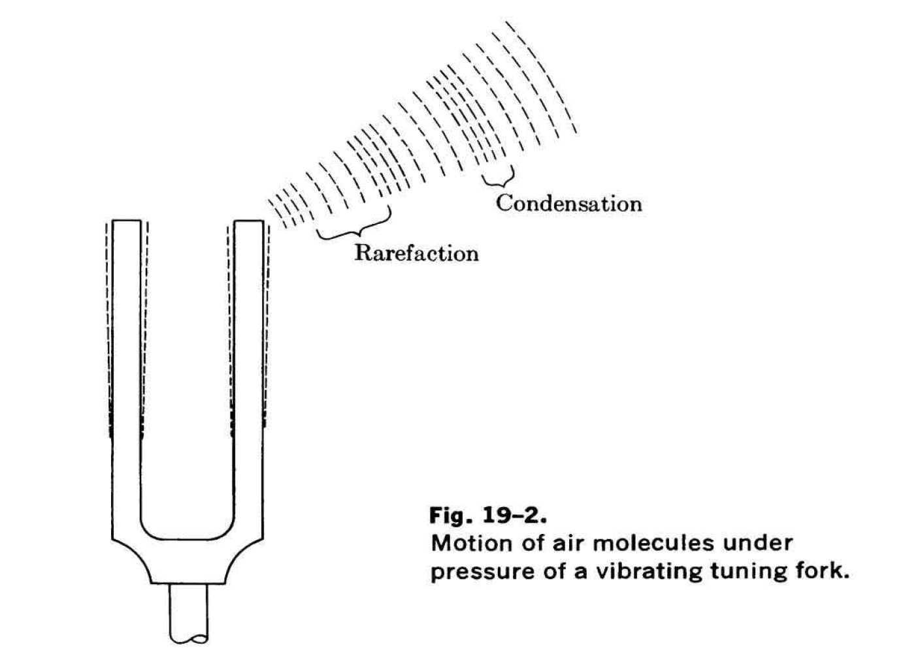

  

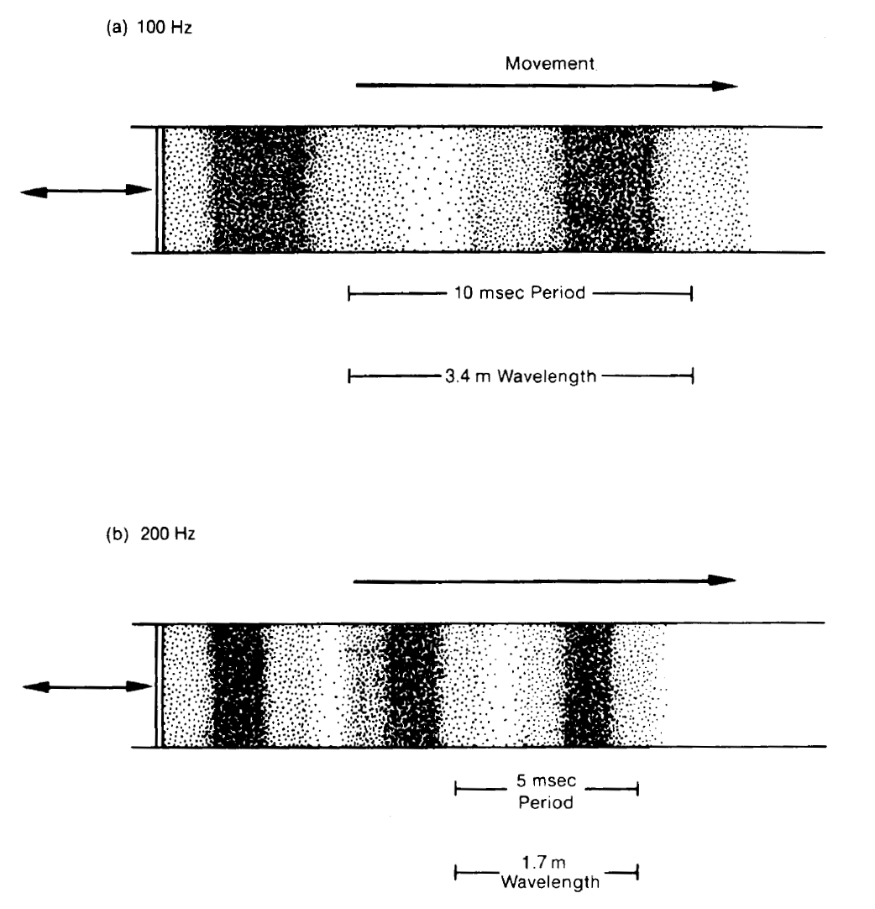

  

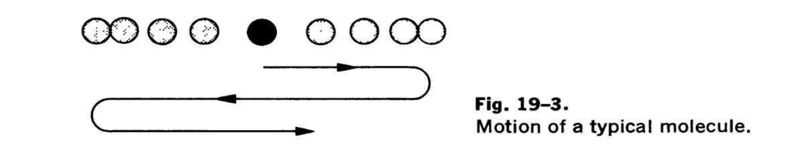

  

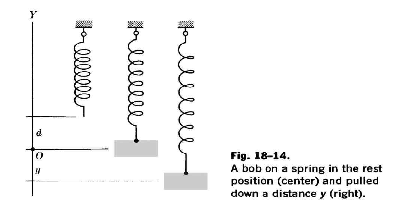

  

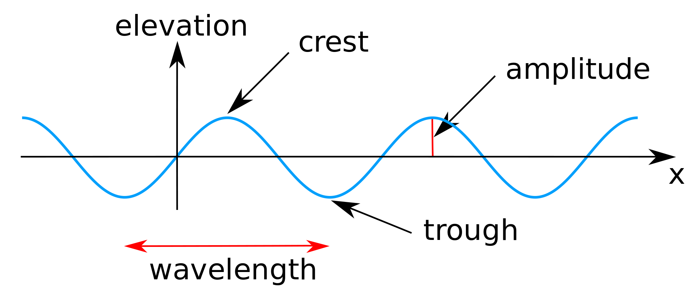

[Credit: Wikimedia Commons](https://commons.wikimedia.org/wiki/File:Sine_wave_amplitude.svg)

<!--
You clap your hands, there's some vibration, then it dies away. Just like a bob on a spring.
-->

### Mixing signals

<!-- sound as a linear system, for the most part:

analogy to multiple signals traveling on a fiber optic cable
 -->

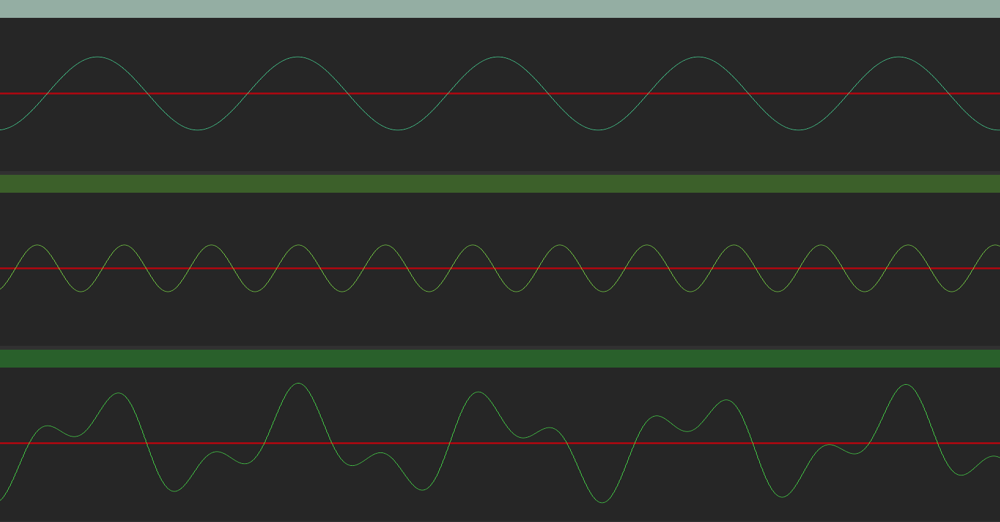

  

<!-- one examples of signals being mixed -->

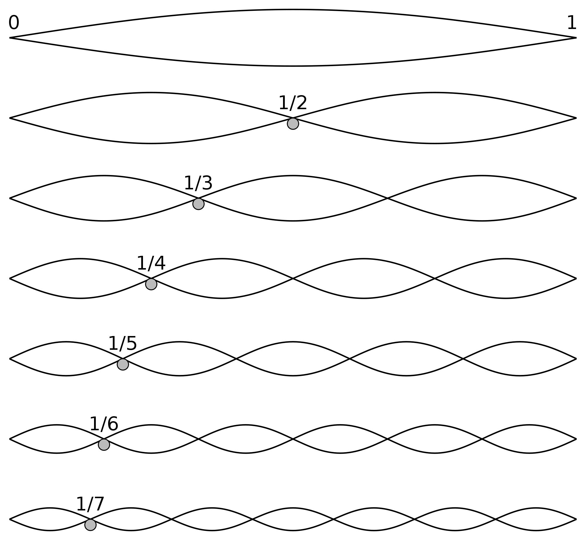

[Credit: Wikimedia Commons](https://commons.wikimedia.org/wiki/File:Harmonic_partials_on_strings.svg)

<!-- spectrogram of a pitched instrument -->

<!-- timbre determined (more or less) by the energy of each partial -->

  

### From the time domain to the frequency domain

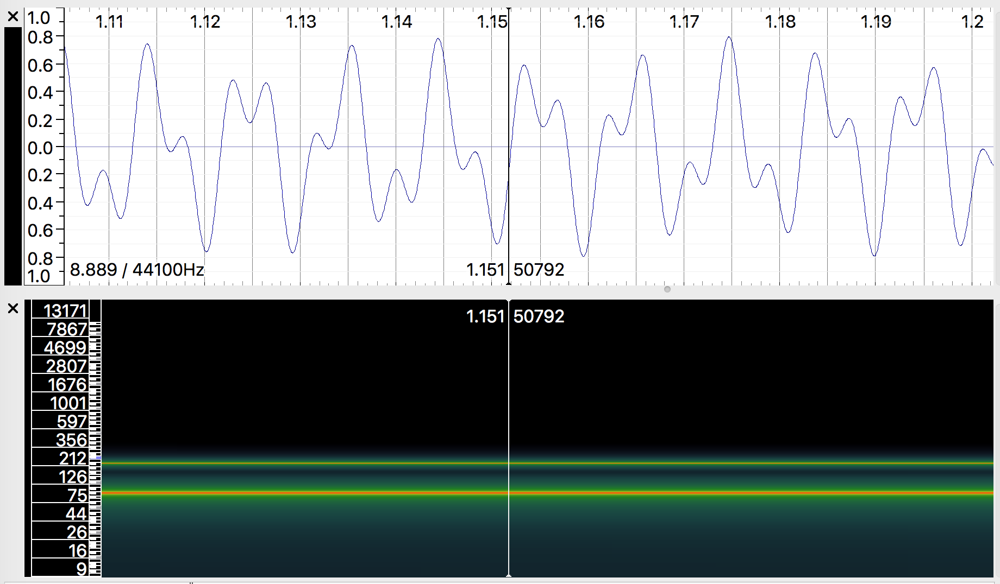

<!--
Any signal we measure can be decomposed into a series of waves at different frequencies, called a Fourier series.
-->

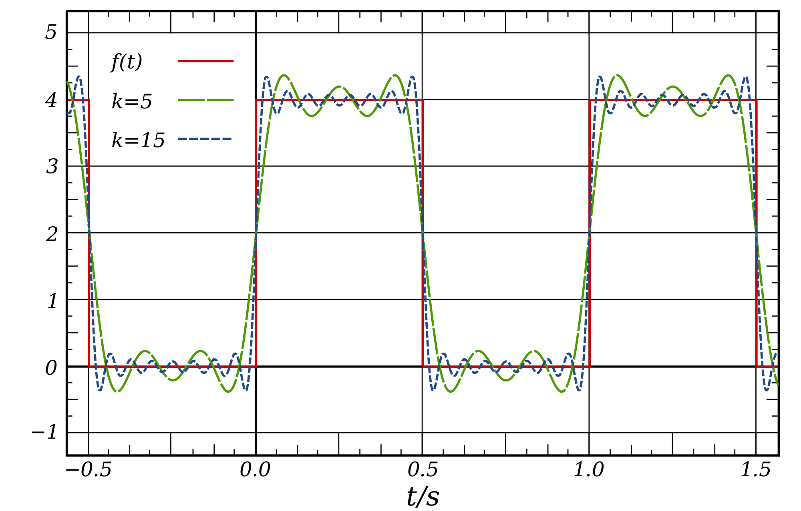

[Credit: Wikimedia Commons](https://commons.wikimedia.org/wiki/File:Square_Wave_Fourier_Series.svg)

  

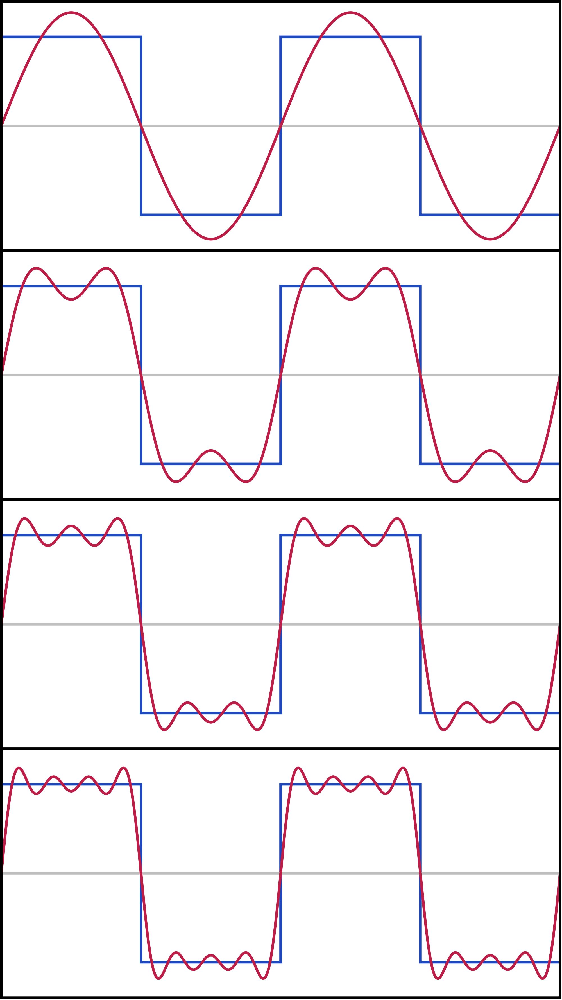

[Credit: Wikimedia Commons](https://commons.wikimedia.org/wiki/File:Fourier_Series.svg)

  

### Analog vs. Digital

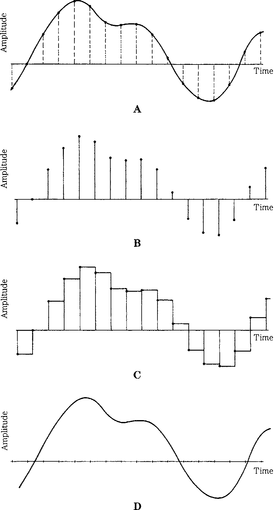

  

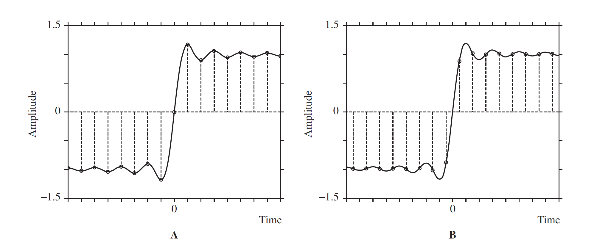

  

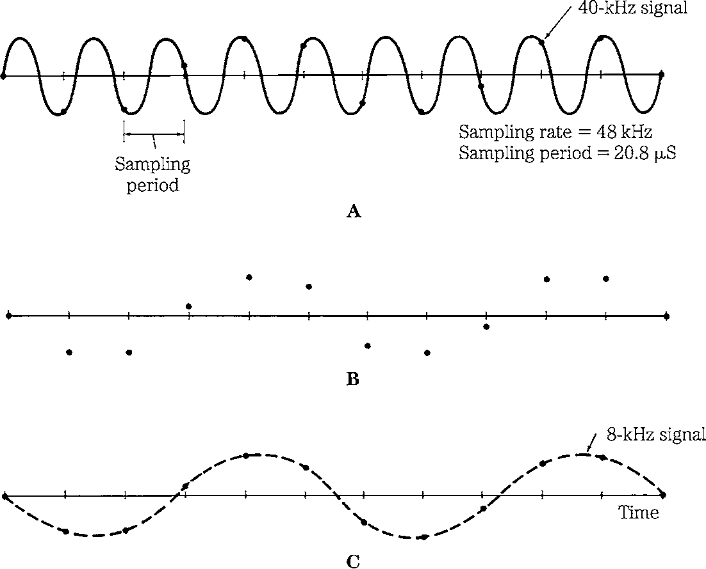

### Bit depth and sample rate

[*>> Forward to 1.4*](1.4.md)
