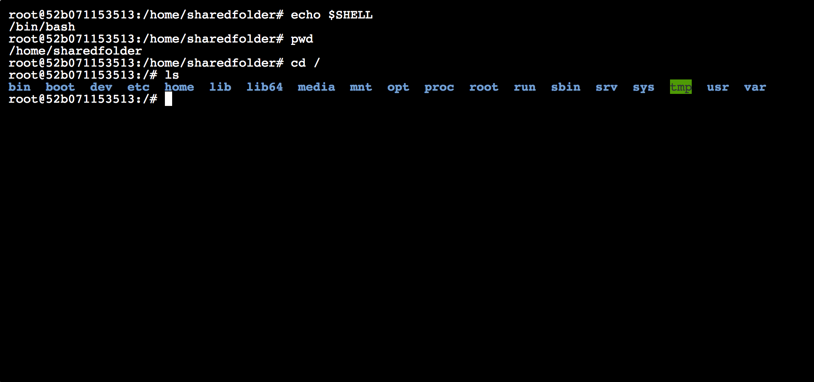
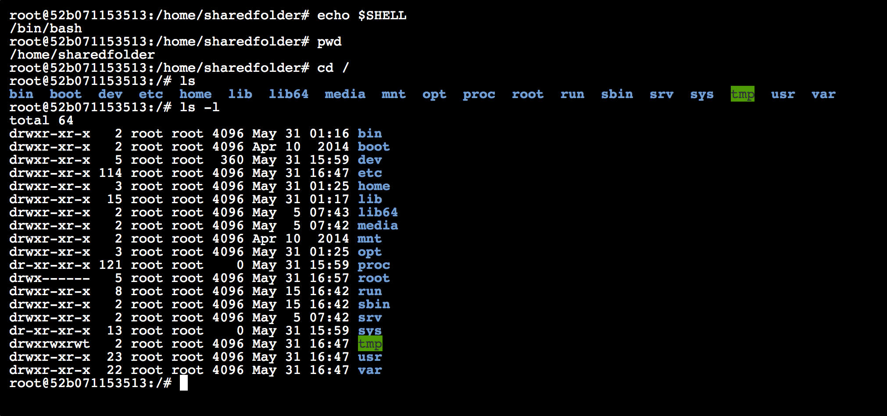
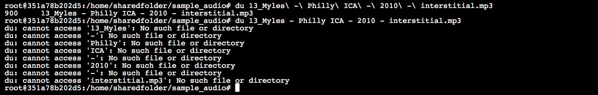
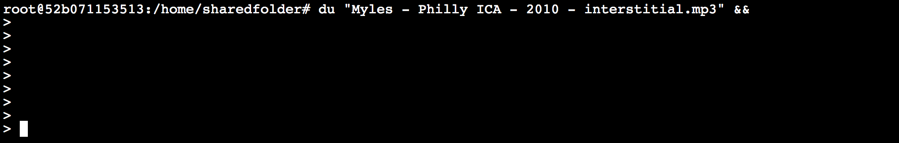

# Day 1, Session 3
### 1:30 – 2:30 pm

<!-- talk briefly about unix history -->

<!-- link to Stephenson -->


## Command-line introduction
<!-- (11:30–12:00) -->

<!-- People will work on their own. -->

<!-- We can continue after lunch if people are taking a while. -->


### Getting started

In Jupyter, click `New`, then `Terminal` in the upper right to launch a new terminal window. Before we go further, you may find it helpful to open the following cheat sheet in your browser: Unix/Linux Command Reference ()(http://cc.iiti.ac.in/lcommands.pdf).

First, a few notes on semantics. While in many cases we can use the terms “command line,” “terminal,” and “shell” interchangeably, each denotes something slightly different.

“**Command line**” has the broadest scope, referring to a general style of interface. A command-line interface (CLI), also known as a command-line interpreter, is any system in which all interaction occurs via text-based commands issued through a keyboard.

A **terminal**, or more accurately a terminal emulator, is an application in your local operating system that essentially just provides a window to type in. We're using Jupyter's terminal through the browser so that everyone in the class is on the same page. Most macOS users use [Terminal](https://en.wikipedia.org/wiki/Terminal_(macOS)), while [Cygwin](https://www.cygwin.com/) is a popular option for Windows users who prefer a Unix-style interface to the DOS command prompt. In most versions of Linux, pressing `Ctrl+Alt+T` will launch a new terminal window.

In your terminal window, type the following and press return. (Note that there is a space after `echo`.)

```
echo $SHELL
```

A **shell** is the software layer between user input and the rote world of file system maintenance. A graphical user interface (GUI) like macOS or Windows is technically considered a shell, but if someone refers to “the shell” they typically mean a command-line interpreter such as [Bash](https://en.wikipedia.org/wiki/Bash_(Unix_shell)).

The command you entered above returns `/bin/bash`, which is the location of Bash’s “binary,” or machine-readable application file.

### The file system

Unix-like operating systems are based on a metaphor: a nested set of directories and data files, forming a tree structure that begins at the root directory `/`. A benefit of this arrangement is that each file can be uniquely identified using a pathname of the following format:`/directory1/directory2/directory3/file.txt`. Our Docker container is running Ubuntu Linux, which has a separate file system from the primary operating system you're using (macOS, Windows, GUI-based Linux, etc.). The exception is `sharedfolder`, which is a shared volume between the two operating systems.

In a shell session, at any given moment a user metaphorically occupies a particular "working directory" within this greater tree structure. Enter the `pwd` ("print working directory") command to see your current location.

```
pwd
```

For convenience, our Docker container always starts us off in `/home/sharedfolder` by default.

The root directory, `/`, is just like any other folder in the system. Enter the following to change your working directory to root.

```
cd /
```

You won't get any obvious feedback, but you'll notice the location indicted to the left of your cursor has changed. You can view the contents of the current directory with the `ls` command.

```
ls
```



You should see a list of directories including "bin," "boot," "dev", and so on. Add the `-l` option and you’ll see more information on each file.

```
ls -l
```



You can find dozens of other options in the manual for `ls`, which you can launch like so.

```
man ls
```

Use the arrow keys to scroll, then press `q` to return to the shell. You can launch so-called "man pages" this way for most command-line programs installed on your system.

### Bash interface tips

Now let's return to our shared folder.

```
cd /home/sharedfolder
```

If you haven't already done so, enter the following command to download a set of sample audio files.  

```bash
wget -i http://www.stephenmclaughlin.net/HILT/Day_1/1.1_files.txt
```

Now use `ls` to list the files in the current directory.

We can use `du` (short for "disk usage") to check the size of a file in bytes. Try adding the `-h` option after `du` to get the size in a more human-readable format.

```
du sine_440.wav
```

Tab completion is a useful feature of most Unix-like CLIs. If you type the first few letters of a long filename, pressing tab will automatically fill in the rest (as long as there's only one file in the directory beginning with those letters). Type out the following, then press tab to finish the filename.

```
du My
```


You'll note that every space in the filename is preceded by a backslash; these are called **escaped** spaces. Because Bash uses spaces to indicate boundaries between each element of a command, the backslash makes it clear that the following space is part of the filename.

Press return to run that command. Just for fun, let's see what happens when we don't escape our spaces.

```
du Myles - Philly ICA - 2010 - interstitial.mp3
```



The `du` tool looks for a file called `Myles`, then one called `-`, and so on. As an alternative, we can use quotation marks to make it explicit that the filename, including spaces, is a single chunk.

```
du "Myles - Philly ICA - 2010 - interstitial.mp3"
```

To make your life easier, you may want to avoid using spaces in the names of files you create. The underscore (`_`) is a good alternative.

Now enter the same command followed by `&&` and press return.

```
du "Myles - Philly ICA - 2010 - interstitial.mp3" &&
```



Nothing happens! You're stuck in command-line limbo, and pressing return repeatedly doesn't help. If this sort of thing happens by mistake, press `Ctrl+c` (i.e., the `Ctrl` or `control` key and the `c` key at the same time).  This will cancel what you've just entered and bring you back to the regular command prompt. (Incidentally, `&&` is used to string together multiple commands, usually in the same line.)

You may wonder why we're spending so much time on these fiddly Bash details in a course on audio machine learning. The reason is that these non-intuitive interface quirks can be *very* frustrating for beginners — and most programming don't mention them, leaving students to figure them out by trial and error.


[1.5.md](*Forward to 1.5*)
