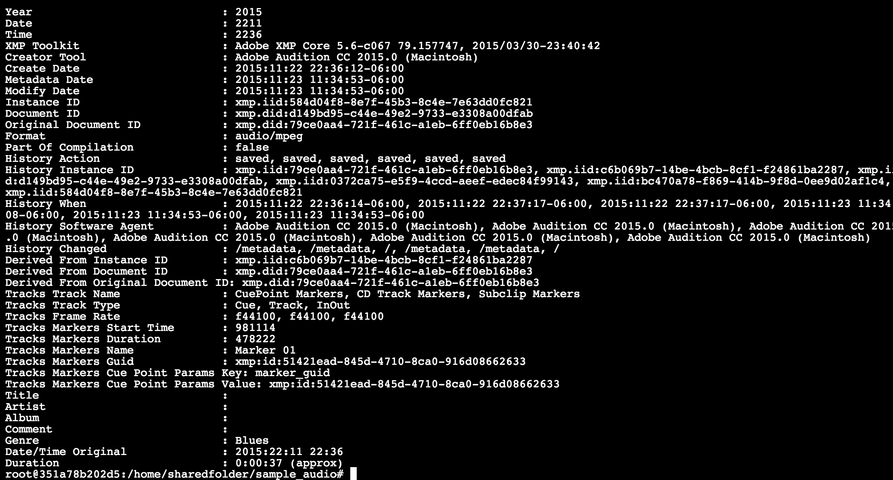
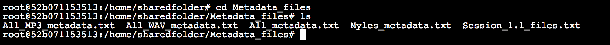

### ExifTool and moving files around

[ExifTool](http://owl.phy.queensu.ca/~phil/exiftool/) is a great CLI program for reading and writing metadata for a wide range of media file formats. Enter the following command to view information about the MP3 file we've been working with. Because the output won't all fit in the terminal window, note that you can scroll up to see the rest.

```
exiftool "Myles - Philly ICA - 2010 - interstitial.mp3"
```



In Unix-like systems, we can use the the `>` operator to write terminal output to disk. The following command will create a new text file called `Myles_metadata.txt`.

```
exiftool "Myles - Philly ICA - 2010 - interstitial.mp3" > Myles_metadata.txt
```

Note that you don't get any feedback in the terminal. Go to your desktop and open `sharedfolder`, then open the new file in your text editor of choice.

You can also use the `cat` tool to quickly view a file's contents in the terminal.

```
cat Myles_metadata.txt
```

In addition to `cat`, several other useful CLI tools for viewing text files are `head`, `tail`, and `less`. Try them all if you like. When using `less`, you can press `q` to return to the command prompt.

If you use `>` with a filename that already exists, you'll simply overwrite that file. Using `>>` instead will add your new output to the end of the existing file. The following command will run `exiftool` on all files in the current directory and write the output to a single text file.

```
exiftool * >> All_metadata.txt
```

We can also add text to the beginning and/or end of the `*` wildcard operator to filter by filename.

```
exiftool *.wav >> All_WAV_metadata.txt
```

```
exiftool *.mp3 >> All_MP3_metadata.txt
```

Now let's make a new directory and move those text files into it. The following command creates a directory called `ExifTool_metadata`.

```
mkdir ExifTool_metadata
````

We can use the `mv` tool to move a single file into the new directory.

```
mv All_metadata.txt ExifTool_metadata
```

Or we can move every file ending in ".txt" like so.

```bash
mv *.txt ExifTool_metadata
```

Now let's `cd` into our new directory and view its contents.

```
cd ExifTool_metadata
ls
```


A useful shortcut is `../`, which refers to the parent directory of our current location on the file tree. Let’s use it to `cd` back to `sharedfolder`.

```
cd ../
```

Finally, we’ll delete the directory we just created along with its contents. Entering `rm` followed by a filename will delete that file; adding the `-r` option tells it to remove files recursively, meaning everything in the specified folder gets wiped out.

```
rm -r ExifTool_metadata
```

Be careful with `rm`, especially in recursive mode. It deletes files permanently rather than sending them to a Trash folder, so a small mistake can really ruin your day.


[1.6.md](*Forward to 1.6*)
