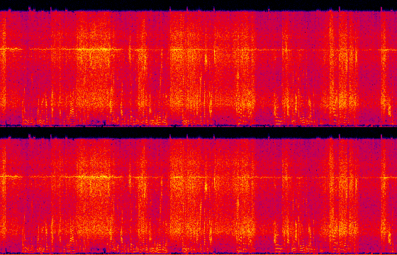
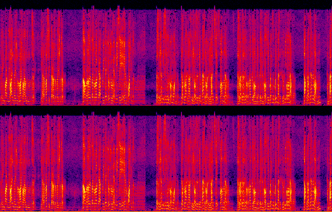
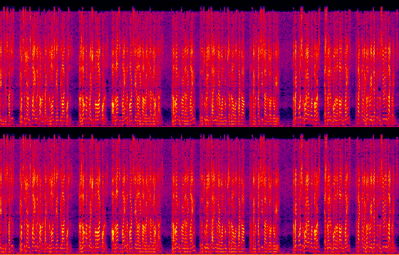
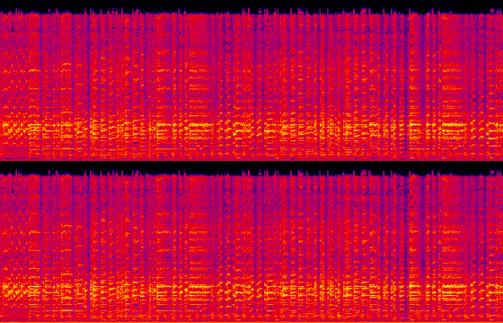

## NBC overseas correspondent classifier


[Download Jupyter Notebook](https://raw.githubusercontent.com/stevemclaugh/HILT-Audio-ML/master/Day_2/2.8_NBC_Overseas_Correspondent_Classifier.ipynb) or use wget:

```
wget https://raw.githubusercontent.com/stevemclaugh/HILT-Audio-ML/master/Day_2/2.8_NBC_Overseas_Correspondent_Classifier.ipynb
```


### Noisy audio from an overseas correspondent




### "Clean" broadcast from the U.S.






### Music



